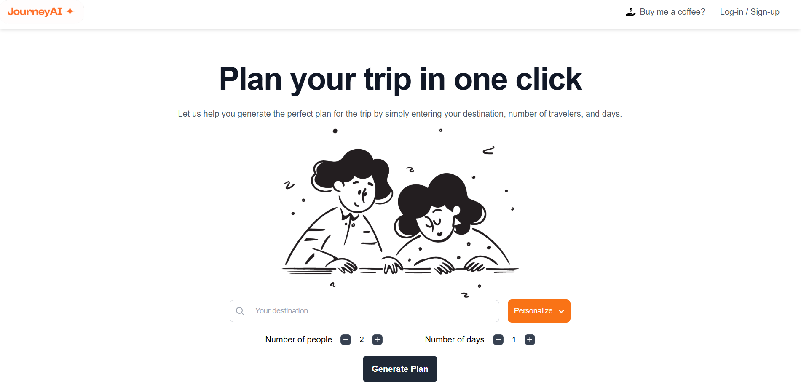
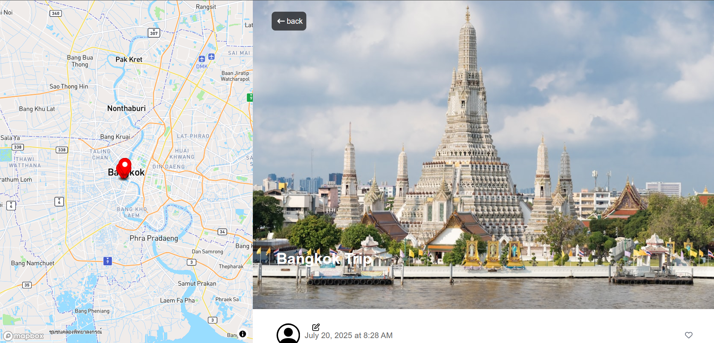

# JourneyAI

# 🌍 JourneyAI: Your AI Travel Planning Assistant ✈️

> Plan your dream trip in seconds with AI-powered recommendations for destinations, itineraries, and activities.

## 🧠 Powered by AI, Built for Adventurers

JourneyAI is a smart travel planning web application that leverages Google Gemini's AI capabilities to help users generate customized travel itineraries based on preferences, budget, and travel style.

### ✨ Key Features

- 🗺️ **AI-Powered Itinerary Generation** — Get personalized day-by-day travel plans with a single prompt.
- 🔎 **Smart Destination Discovery** — Explore hidden gems and tourist favorites tailored to your interests.
- ⚡ **Real-Time API Optimization** — Fast responses and cost-efficient performance using Gemini API.
- 📱 **Mobile-First UI** — Sleek, responsive design for users on the go.

 

## 🔧 Tech Stack
React
Tailwind
FirebaseDB
Gemini
Google Places & Photos API

## 🚀 How It Works

1. User enters a destination "Bangkok, Thailand”.
2. Gemini API processes in the backend and returns a complete travel plan along with estimated costs.
3. Users can view, edit, or create account to save favourite plans.

 
